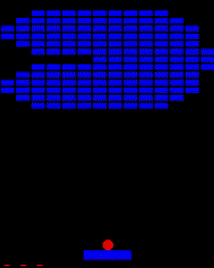

# CPPND: Capstone BreakOut Game Project 

This is the repo for the Capstone project in the [Udacity C++ Nanodegree Program](https://www.udacity.com/course/c-plus-plus-nanodegree--nd213)

## Description of The Project
* In Breakout, you start with a single ball and a paddle. You can move the paddle left and right to hit the ball. When the ball hits a brick, it breaks the brick and sends the ball flying in a random direction. If the ball hits the bottom of the screen, you lose a life. You have four lives to break all the bricks on the screen.
* Actually the project was designed as simple 2D Game Framework
* Classes can be used for creating other 2D games.

## How to Play
* You can start with press `A` key
* You can navigate the paddle using left and right arrow keys
* You can restart the game by pressing `A` key if you don't have any lives

## Level System
* `BreakoutLevels.txt` file must be located in the `Assets` folder which is located in ./build/Release
*  Path should be `./build/Release/Assets/BreakoutLevels.txt` and file name must be `BreakoutLevels.txt`
  * You can edit levels or add new level by using txt file
    
    * fillcolor format: RGBA
    * hp: How many hits are required to break same brick
  

## Architecture of Classes
* Singleton Design Pattern was used in the project
* Project adapted for creating multiple games in one framework.
  
* 2D Vector class was implemented from scratch in `Utils`.
* `./src/Games` implemented library includes game classes.
* `./src/Graphics` implemented library manages SDL Rendering system.
* `./src/Shapes` implemented library is responsible for creating basic shapes.

## Compliance with the Criteria in The Project Rubric
* Criteria List (Top 5)
  * The project demonstrates an understanding of C++ functions and control structures.
    * The criterion was met in the entire project structure
  * The project reads data from a file and process the data, or the program writes data to a file.
    * Level information is read from the file and the game starts accordingly.
  * The project accepts user input and processes the input.
    * The Program accepts keyboard inputs to process game mechanics.
  * The project uses Object-Oriented Programming techniques.
    * The criterion was met in the entire project structure
  * Classes use appropriate access specifiers for class members.
    * The criterion was met in the entire project structure
    
  
## Dependencies for Running Locally
* cmake >= 3.7
  * All OSes: [click here for installation instructions](https://cmake.org/install/)
* make >= 4.1 (Linux, Mac), 3.81 (Windows)
  * Linux: make is installed by default on most Linux distros
  * Mac: [install Xcode command line tools to get make](https://developer.apple.com/xcode/features/)
  * Windows: [Click here for installation instructions](http://gnuwin32.sourceforge.net/packages/make.htm)
* SDL2 >= 2.0
  * All installation instructions can be found [here](https://wiki.libsdl.org/Installation)
  >Note that for Linux, an `apt` or `apt-get` installation is preferred to building from source. 
* gcc/g++ >= 5.4
  * Linux: gcc / g++ is installed by default on most Linux distros
  * Mac: same deal as make - [install Xcode command line tools](https://developer.apple.com/xcode/features/)
  * Windows: recommend using [MinGW](http://www.mingw.org/)

## Basic Build Instructions
### Linux (Tested On Udacity Workspace)
1) Cloning Repo and build appropriate SDL library for my project (even you have installed SDL on your system)
   * `git clone https://github.com/ahmetyaylalioglu/Breakout_Game_Project.git` 
   * `cd Breakout_Game_Project`
   * `wget https://github.com/libsdl-org/SDL/archive/refs/tags/release-2.26.5.zip`
   * `unzip release-2.26.5.zip`
   * `cd SDL-release-2.26.5`
     * `./configure`
     * `make all`
     * `sudo make install`

2) Change current directory as Breakout_game_cpp Directory
   * `cd ..`
   * `cd Breakout_game_cpp`
   * `mkdir build`
   * `cp -R Assets/ build/`   (Copy Assets folder into build directory for level file)
   * `cd build`
   * `cmake ..`
   * `make`
   * `./Breakout_Game_CapStone_Udacity`
   

## CC Attribution-ShareAlike 4.0 International

Shield: [![CC BY-SA 4.0][cc-by-sa-shield]][cc-by-sa]

This work is licensed under a
[Creative Commons Attribution-ShareAlike 4.0 International License][cc-by-sa].

[![CC BY-SA 4.0][cc-by-sa-image]][cc-by-sa]

[cc-by-sa]: http://creativecommons.org/licenses/by-sa/4.0/
[cc-by-sa-image]: https://licensebuttons.net/l/by-sa/4.0/88x31.png
[cc-by-sa-shield]: https://img.shields.io/badge/License-CC%20BY--SA%204.0-lightgrey.svg
